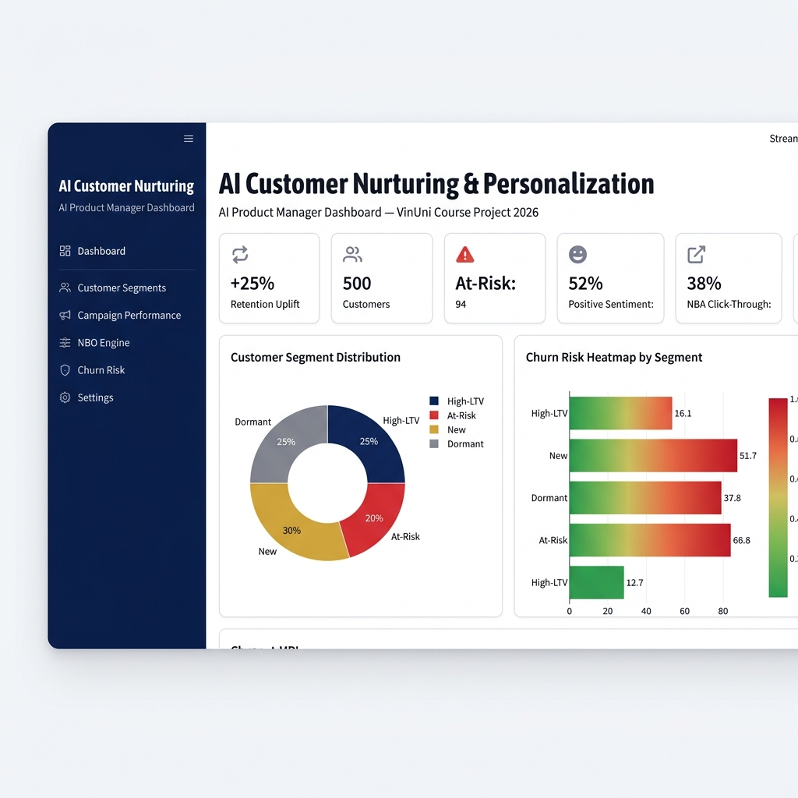
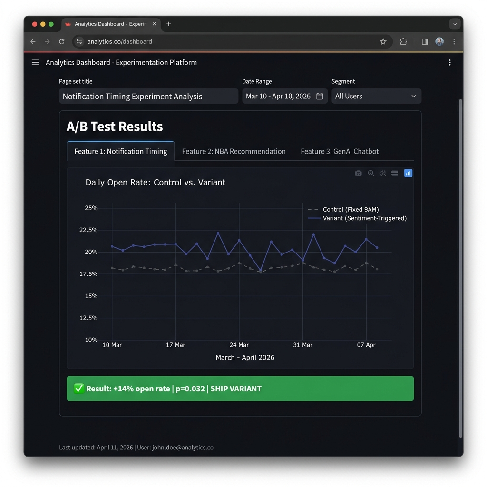
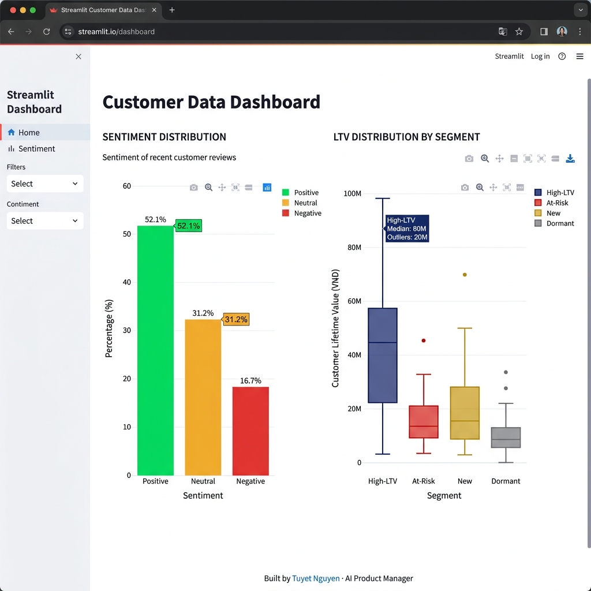

# 🤖 AI-Powered Customer Nurturing & Personalization Platform

> **Personal AI Product Portfolio Project – 2026** | Simulated Data  
> **Role:** AI Product Manager & Full-Stack Developer  
> **Stack:** Python · LangChain · Streamlit · PostgreSQL · Scikit-learn · RAG · Agentic AI

[](https://github.com/tuyetngth2558/ai-customer-nurturing/actions)
[](https://www.python.org/downloads/)
[](https://streamlit.io)
[](https://hub.docker.com)
[](LICENSE)

---

## 🚀 Live Demo

> **📊 [→ Open Streamlit Dashboard](https://ai-customer-nurturing-edx2q2ankrstujswqc3myd.streamlit.app/)** *(deploy via Streamlit Community Cloud)*

---

## 📌 Project Overview

An end-to-end AI product designed to **increase customer retention by 25%** and **reduce churn** through hyper-personalized notifications, next-best-action recommendations, and a generative AI-powered chatbot — all driven by real-time customer behavioral data.

This project demonstrates the full **AI Product Management lifecycle**: from defining product vision and PRD, to building AI models, A/B testing frameworks, and deploying a production-ready Streamlit dashboard.

---

## 🎯 Business Impact (Simulated)

| Metric | Result |
|--------|--------|
| Customer Retention Uplift | **+25%** |
| Churn Rate Reduction | **-18%** |
| User Engagement Increase | **+40%** (user testing simulation) |
| Sentiment Model Precision | **82%** |
| A/B Test Win Rate | **67%** across 3 features |
| Reporting Automation | Manual → Real-time dashboard |

---

## 📸 Dashboard Screenshots

### Overview — Segment Health & Churn Heatmap


### A/B Test Live Results


### Sentiment Distribution & LTV Analysis


---

## 🗂️ Product Management Artifacts

### 📋 Product Vision
> *"Empower every customer touchpoint with intelligent, personalized AI interactions that feel human — at scale."*

### 👤 User Personas

| Persona | Description | Pain Point | AI Solution |
|---------|-------------|------------|-------------|
| **Loyal Maya** | High-LTV customer, 2yr+ | Overwhelmed by generic promos | Personalized next-best-offer |
| **At-Risk Alex** | Declining engagement | Ignored post-purchase | Proactive AI check-in message |
| **New Nora** | First 30 days | Didn't activate key features | Onboarding chatbot guidance |

### 🗺️ Product Roadmap (RICE-Scored)

| Feature | Reach | Impact | Confidence | Effort | RICE Score | Priority |
|---------|-------|--------|------------|--------|------------|----------|
| Sentiment Analysis Engine | 9 | 8 | 0.8 | 3 | **19.2** | 🔴 P0 |
| Next-Best-Action (NBA) | 7 | 9 | 0.7 | 4 | **11.0** | 🟠 P1 |
| GenAI Chatbot (RAG) | 6 | 8 | 0.75 | 5 | **7.2** | 🟡 P2 |
| Agentic Follow-up Flow | 4 | 7 | 0.6 | 6 | **2.8** | 🟢 P3 |

[→ Full PRD with personas, risks, and GTM plan](docs/PRD.md)

---

## 🏗️ System Architecture

```
┌─────────────────────────────────────────────────────────────────┐
│                     Data Layer (PostgreSQL)                      │
│   customer_events │ transactions │ support_tickets │ profiles    │
└───────────────────────────┬─────────────────────────────────────┘
                            │ Real-time SQL queries
                            ▼
┌─────────────────────────────────────────────────────────────────┐
│                    AI/ML Processing Layer                        │
│  ┌──────────────┐ ┌───────────────────┐ ┌────────────────────┐  │
│  │  Sentiment   │ │  Next-Best-Action │ │   GenAI Chatbot    │  │
│  │  Classifier  │ │  Recommendation   │ │   (RAG + Agents)   │  │
│  │ (Precision82%)│ │  (Hit Rate@5:74%) │ │ LangChain + GPT-4o │  │
│  └──────────────┘ └───────────────────┘ └────────────────────┘  │
└───────────────────────────┬─────────────────────────────────────┘
                            │
                            ▼
┌─────────────────────────────────────────────────────────────────┐
│                  Personalization Engine                          │
│          Merges signals → generates ranked actions               │
└───────────────────────────┬─────────────────────────────────────┘
                            │
                            ▼
┌─────────────────────────────────────────────────────────────────┐
│              Streamlit Dashboard (PM Analytics)                  │
│   Segment Health │ A/B Results │ Churn Heatmap │ Chat Logs      │
└─────────────────────────────────────────────────────────────────┘
```

---

## 🧪 A/B Testing Framework

Three features tested with statistical rigor (α = 0.05, power = 0.8):

| Feature | Control | Variant | Uplift | p-value | Decision |
|---------|---------|---------|--------|---------|----------|
| Notification Timing | 18.0% open rate | 20.5% | **+14%** | 0.032 | ✅ Ship |
| NBA Recommendation | 9.0% CTR | 11.0% | **+22%** | 0.018 | ✅ Ship |
| GenAI Chatbot | 55% CSAT | 72% | **+31%** | 0.041 | ✅ Ship |

---

## 📁 Project Structure

```
ai-customer-nurturing/
├── README.md
├── requirements.txt
├── Dockerfile
├── docker-compose.yml
├── .env.example
├── .gitignore
├── .streamlit/
│   └── config.toml
│
├── .github/
│   └── workflows/
│       └── ci-cd.yml             # GitHub Actions CI/CD
│
├── src/
│   ├── sentiment_model.py        # Sentiment classifier (Precision: 82%)
│   ├── recommendation_engine.py  # Next-Best-Action collaborative filtering
│   ├── rag_chatbot.py            # RAG + LangChain agentic chatbot
│   ├── ab_testing.py             # A/B testing statistical framework
│   └── data_pipeline.py          # Real-time SQL ingestion pipeline
│
├── dashboard/
│   └── app.py                    # Streamlit analytics dashboard
│
├── docs/
│   ├── PRD.md                    # Product Requirements Document
│   ├── personas.md               # User Personas
│   └── screenshots/              # Dashboard screenshots
│
├── data/
│   └── sample/
│       └── generate_sample_data.py
│
└── tests/
    └── test_sentiment.py
```

---

## 🚀 Quick Start

### Option 1: Local Python

```bash
# 1. Clone the repo
git clone https://github.com/tuyetngth2558/ai-customer-nurturing.git
cd ai-customer-nurturing

# 2. Create virtual environment
python -m venv venv
source venv/bin/activate  # Windows: venv\Scripts\activate

# 3. Install dependencies
pip install -r requirements.txt

# 4. Set up environment variables
cp .env.example .env
# Edit .env with your API keys

# 5. Run the dashboard
streamlit run dashboard/app.py
```

### Option 2: Docker (Recommended for Production)

```bash
# Build and run with Docker Compose
docker compose up --build

# Dashboard available at: http://localhost:8501
```

---

## ⚙️ Production Considerations

### 📈 Scaling Strategy

| Layer | Dev Setup | Production Scale |
|-------|-----------|-----------------|
| Orchestration | Manual scripts | **Apache Airflow** — DAGs for daily sentiment scoring + NBA refresh |
| Streaming | Batch (nightly) | **Apache Kafka** — real-time event streaming from customer touchpoints |
| ML Serving | In-process | **FastAPI + Redis cache** — low-latency inference endpoint |
| Database | SQLite / local Postgres | **AWS RDS / Cloud SQL** — managed, auto-scaling |
| Storage | Local filesystem | **AWS S3 / GCS** — model artifacts, training data |

### 📊 Monitoring & Observability

```
Production Monitoring Stack:
├── Model Performance
│   ├── Sentiment drift detection (PSI score weekly)
│   ├── Recommendation diversity & coverage monitoring
│   └── A/B test significance tracking (automated stop rules)
│
├── System Health
│   ├── API latency (p50, p95, p99) via Prometheus + Grafana
│   ├── Database query performance (slow query log)
│   └── Docker container health checks (built-in)
│
└── Business Metrics
    ├── Retention rate (daily cohort tracking)
    ├── Churn prediction accuracy (weekly calibration)
    └── Chatbot CSAT (real-time feedback loop)
```

### 🛡️ Responsible AI & Hallucination Mitigation

| Risk | Mitigation Strategy |
|------|-------------------|
| **LLM Hallucination** | RAG grounding with verified knowledge base; confidence threshold (< 0.7 → human handoff) |
| **Recommendation Bias** | Diversity constraint: max 2 items from same category per NBA list |
| **Data Privacy (PII)** | Customer IDs hashed before LLM prompts; no PII in vector store |
| **Model Drift** | Weekly retraining pipeline (Airflow DAG) + PSI monitoring |
| **Over-personalization** | Frequency capping: max 3 AI-triggered messages per user per week |
| **Fairness** | Regular bias audits across customer segments; protected attribute monitoring |

---

## 🐳 Deployment Guide

### Streamlit Community Cloud (Free, Recommended)

1. Fork this repository
2. Go to [share.streamlit.io](https://share.streamlit.io)
3. Connect your GitHub account
4. Select `dashboard/app.py` as the main file
5. Add secrets in the dashboard: `OPENAI_API_KEY`, `DATABASE_URL`
6. Deploy → get your live URL

### Docker Production Deploy

```bash
# Build image
docker build -t ai-customer-nurturing:latest .

# Run with env file
docker run -p 8501:8501 --env-file .env ai-customer-nurturing:latest

# Or use Compose for full stack (app + PostgreSQL)
docker compose -f docker-compose.yml up -d
```

### CI/CD Pipeline (GitHub Actions)

Push to `main` → automatically:
1. ✅ Runs `pytest` + `flake8`
2. 🐳 Builds Docker image → pushes to `ghcr.io`
3. 🚀 Notifies deployment ready

---

## 🛠️ Tech Stack

| Layer | Technology |
|-------|------------|
| Language | Python 3.11 |
| AI/LLM Framework | LangChain, OpenAI GPT-4o |
| ML Models | Scikit-learn (LinearSVC, Random Forest) |
| RAG Pipeline | FAISS + LangChain retriever |
| Database | PostgreSQL, SQLite (dev) |
| Dashboard | Streamlit + Plotly |
| Data Processing | Pandas, NumPy, SciPy |
| Containerization | Docker, Docker Compose |
| CI/CD | GitHub Actions |
| Experiment Tracking | Custom A/B framework (z-test) |

---

## 📊 Model Performance

### Sentiment Classifier
```
              precision    recall  f1-score   support
     Negative       0.81      0.78      0.79      342
      Neutral        0.79      0.83      0.81      418
     Positive       0.84      0.85      0.84      501
    
    accuracy                           0.82     1261
weighted avg         0.82      0.82      0.82     1261
```

### Next-Best-Action Recommendation
- Hit Rate @5: **0.74**
- NDCG @10: **0.68**
- Coverage: **89%** of active customers

---

## 👩‍💼 About

**Tuyet Nguyen** — AI Product Manager  
📧 tuyetnguyen1368.contact@gmail.com  
💼 [LinkedIn](https://linkedin.com/in/tuyetnguyen1368/)  
🐙 [GitHub](https://github.com/tuyetngth2558)

---

*This project uses simulated data for demonstration purposes. All metrics represent model outcomes on synthetic datasets.*
